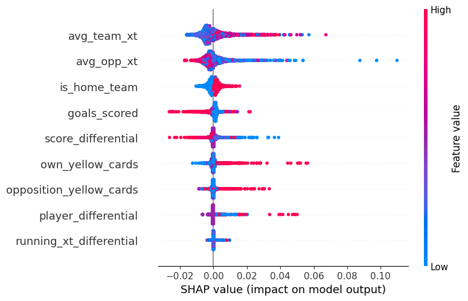
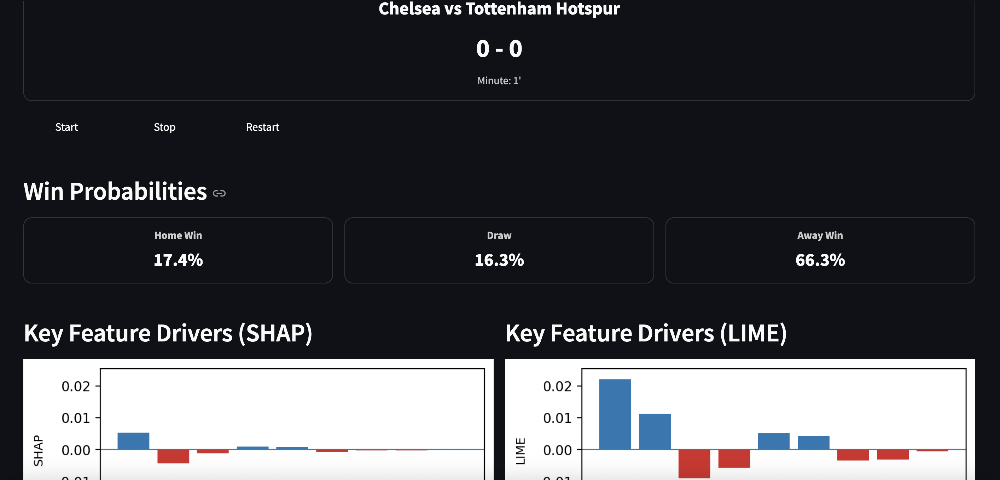
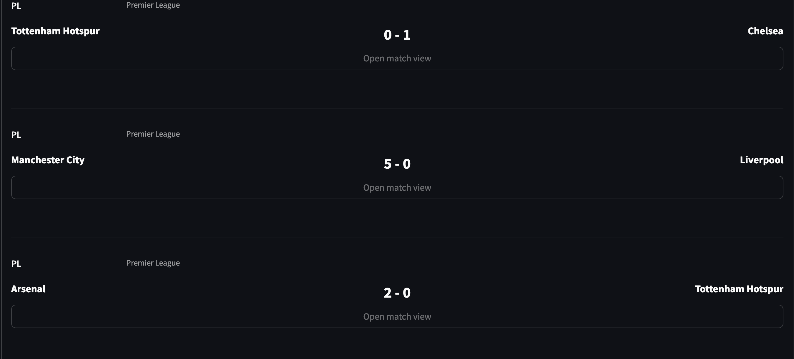
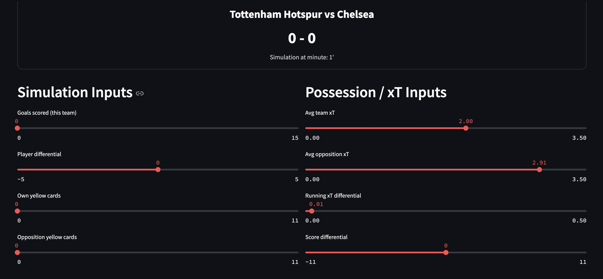

# XAI-Soccer 


Explainable, minute-by-minute win probability modeling for football matches (Premier League baseline).

Currently, almost every major competition uses probability-based ML models to show viewers the likely outcome of a match at different moments. However, these systems offer almost no transparency, which makes it difficult for both fans and smaller clubs to understand what drives those predictions, what’s going wrong during a match, and what could be adjusted.

This project replicates the live win-probability mechanism used by major analytics platforms. It predicts **per-team scoring probability at each minute**, then simulates the rest of the game to produce **Home Win / Draw / Away Win** probabilities. Each probability is explained using **SHAP** and **LIME**, and a **Streamlit dashboard** lets you explore matches and run what-if simulations.

[Watch the demo on YouTube](https://youtu.be/OO64UQUwe_s)


## What this project does

1. **Process event-level soccer data** into a minute-level match state.
2. Train a model to estimate **team scoring probability per minute**.
3. Convert those scoring probabilities into **win/draw/win** using Monte-Carlo simulation.
4. Explain *why* the model predicts a certain probability with **SHAP** and **LIME**.
5. Provide a **dashboard** to:
   - browse simulated matches  
   - view win probabilities over time  
   - inspect SHAP/LIME drivers at any minute  
   - simulate feature changes and see updated win probabilities


## Core features

- **Minute-level match state** with game context:
  - score differential
  - players on pitch (red cards)
  - yellow cards
  - xT pressure / momentum
- **Scoring probability model** (LightGBM baseline)
- **Win probability simulation**
- **Explainability**
  - SHAP barplot for any (match, team, minute)
  - LIME barplot for any (match, team, minute)
- **Streamlit app**
  - Home page listing matches
  - Match View page (win prob progression + SHAP/LIME)
  - Simulation page (change features and see new win probs)
- **Src**
  -- Contains reproducible code for data processing, feature building, modeling, explainability, and dashboard


## Setup
1. Clone this repository
2. Create a virtual environment and activate it or use global python environment
3. Install dependencies:
   ```bash
   pip install -r requirements.txt
   ```
4. Download the Wyscout dataset from Figshare (https://figshare.com/collections/Soccer_match_event_dataset/4415000/5)  and place it in the `wyscout_figshare_data/` folder.
5. Run the notebooks in order:
   - `1-data_preprocessing.ipynb`
   - `2-building-features.ipynb`
   - `3-modelling_extraction.ipynb`
6. Launch the Streamlit dashboard:
   ```bash
   streamlit run dashboard/Home.py
   ```  


## Documentation

### Modelling
Building minute-by-minute win predictions is hard because most detailed live match data is owned by private companies. Thankfully, Wyscout makes a rich event dataset available for research, and this project starts by processing that data. First, the raw events are split into individual matches and converted into simple per-minute signals such as goals so far and yellow cards so far. Next, using information from previous matches, we add broader context features like a team’s average xT (a proxy for how well a team progresses the ball into dangerous areas), along with live game context such as red cards, home/away identification, and other match-state indicators. Finally, all of these pieces are merged into a single processed dataset that is used for modeling.

The project implements a Win Probability Model that estimates the chance of a team winning, drawing, or losing at any moment in a match. Rather than predicting the final score directly, we train a regression model using LightGBM to estimate each team’s probability of scoring in the remaining minutes based on the current game state. These scoring probabilities are then passed into a simulation engine, which runs many iterations of the rest of the match to convert scoring chances into Home Win, Draw, and Away Win probabilities.

The model uses a mix of game-state, discipline, and advanced xT features. Game-state features capture the live situation, such as score_differential, goals_scored, minutes_remaining, time_interval, and whether the team is at home. Advanced xT features include avg_team_xt as a measure of team strength, avg_opp_xt as a measure of opponent strength, and running_xt_differential to reflect live momentum. Discipline features account for numerical advantage and cautions, including player_differential (red cards), own_yellow_cards, and opposition_yellow_cards.

### Explainability
Since the model is already trained, the next step is to understand what actually drives its decisions. For that reason, I applied SHAP and LIME to interpret the predictions. These methods gave me both global explanations, which show overall feature importance across matches, and local explanations, which justify a specific prediction at a specific minute. From the plots, it’s clear that team xT is one of the strongest drivers. This makes sense because xT reflects how effectively a team progresses the ball into dangerous areas, so it captures both current form and overall quality. Player differential also shows up as a major factor, which is intuitive: when a team goes down to 10 or 9 players, it becomes much harder to cover space and defend, and that disadvantage often translates into a higher chance of losing.




However, explanation alone isn’t enough, because football is highly dynamic. The state of a match can shift dramatically from minute to minute ,  a single mistake, tackle, or sudden goal can flip the outlook. That’s why I built an interactive simulation layer, so the model can be explored in real time and users can see how win probabilities and feature drivers change as the match evolves.

### Dashboard Integration
Lastly, to avoid manually tweaking inputs and checking predictions minute by minute, I built a Streamlit dashboard that lets users simulate matches interactively and inspect feature contributions at each moment using SHAP and LIME. The app has three main pages. The Home page allows users to select a match to explore. The Match View page shows the evolving win probabilities over time, along with SHAP and LIME explanations for each minute of the chosen match. Finally, the What-If Simulation page lets users adjust the input features and instantly see how the predicted outcomes would change under different match conditions.




For the purpose of this showcasing simulation , I have choosen to focus on the 5 Premier League matches from the 2017-2018 season that I find interesting. However, the codebase is designed to be easily extensible to other leagues and seasons if the data is available.




In addition to the core functionality, I added a What-If Scenario page where users can adjust key match features—such as score differential, player differential, and xT momentum—to observe how these changes influence the predicted win probabilities. This interactive component aimed at to enhance user engagement with the XAI features and provides a clearer understanding of how different match conditions would affect the model’s predictions.




## Future Work and Limitation
There are several clear directions to improve this project. First, the dataset is still quite small because most high-resolution match data is owned and sold by commercial providers. At the moment, the model relies only on Premier League 2017–2018 matches, so expanding to larger and more recent seasons would make the predictions more reliable and better aligned with today’s game. Second, the current feature set is intentionally simple and extracted only from the Wyscout events, but it can be enriched with additional signals, including external data such as player-level attributes, team tactics, or fatigue and scheduling effects. Finally, the biggest upgrade would be deploying the model for real-time matches. To do that properly, the system would need a live data feed that provides ball and player positions so the same in-game features (especially xT-related ones) can be computed on the fly.


Here is a directly copy-ready Markdown snippet you can paste into your README:

*AI Use: This project utilized the GPT-5 model for developing parts of the Streamlit application and refining the text in the README and notebooks. All notebooks include appropriate citations indicating where AI assistance was used. A full record of the conversation is available at the following [conversation Link](https://chatgpt.com/share/69236ad9-3374-8011-8f40-acaf6e31fa50).*